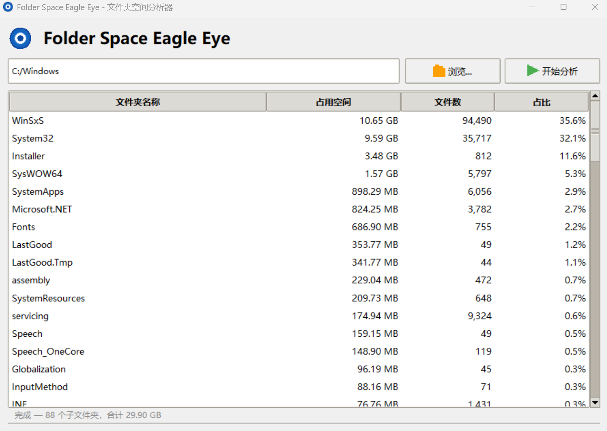

# Folder Space Eagle Eye（文件夹空间鹰眼）

一个基于 Python + Tkinter 的桌面工具，用于**分析文件夹占用空间**：选择一个目标文件夹，它会递归扫描其中所有子文件夹，用表格展示每个子文件夹的占用空间、文件数与占比，帮助你快速定位磁盘空间的“大户”。

## 功能特性

- 🗂️ 选择任意文件夹，一键扫描其下所有子文件夹
- 📊 树形表格展示：名称、占用空间、文件数、占比
- ⏸️ 多线程扫描，随时可停止，界面不卡顿
- 🖱️ 右键菜单：在文件浏览器中打开 / 再次分析
- ⚡ 快捷跳转：双击即可进入子文件夹继续分析

## 运行环境

- Python 3.10+
- 依赖：`Pillow`（仅用于界面图标）

## 快速开始

```bash
pip install -r requirements.txt
python main.py
```

Windows 下也可以直接双击 `run.bat`。

## 打包为可执行文件

项目自带 PyInstaller 打包配置（`FolderSpaceEagleEye.spec`）：

```bash
pip install pyinstaller
pyinstaller FolderSpaceEagleEye.spec
```

生成的单文件程序位于 `dist/FolderSpaceEagleEye.exe`。

## 项目结构

```
main.py                     # 程序入口与全部界面逻辑
requirements.txt            # Python 依赖
FolderSpaceEagleEye.spec    # PyInstaller 打包配置
app.ico                     # 程序图标
run.bat                     # Windows 快捷运行脚本
```

## 截图



## 许可证

本项目基于 [MIT License](LICENSE) 开源。

